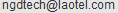

# gmla20: Global Map Laos 2.0
## non-commercial use

## commercial use

## note
Credit: "Global Map of Laos ©ISCGM/ National Geographic Department Prime Minister's Office, Laos"

Contact: National Geographic Department Prime Minister's Office.

E-mail address: 

Postal address: P.O Box 2159, VIENTIANE, LAOS 

Phone number: +856-21-243474, 214917

Fax number: +856-21-213474, 214915
